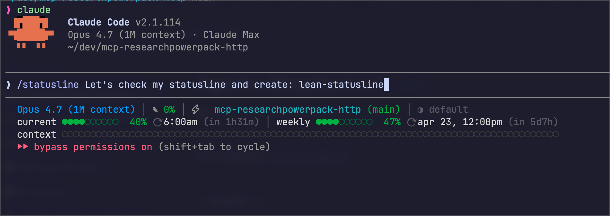

# lean-statusline

[](https://www.npmjs.com/package/lean-statusline) [](https://nodejs.org/) [](LICENSE)

statusline for [claude code](https://claude.com/claude-code). the stuff you actually glance at, nothing you don't.

**stable since v1.0.0.** config schema, CLI surface, segment names, and preset names are semver-committed — see [CHANGELOG.md](CHANGELOG.md) for the exact contract.

```
🔒 mac-mini · Opus 4.7 (1M context) · ✎ 32% · repo (main*)
current ●●●●○○○○○○  40% (in 1h30m) · weekly ●●●●●○○○○○  47% (in 5d6h)
```

default layout is **compact** (two lines): header with model + context % + dir + branch on line 1, rate-limit bars with countdowns on line 2. `minimal` and `full` are one and three-line alternatives. everything's configurable via an interactive TUI wizard.

node-only, zero deps, works on mac/linux/windows. no bash, no jq, no vendored binaries.

## why bother

the stock-ish 3-line statusline eats four rows above every prompt:



on a 40-row terminal that's 10% of your screen re-rendering every time claude emits something. lean-statusline trims the same info to one or two lines depending on preset. session timer, cost, and effort indicator are opt-in, not default.

## install

### one-liner (recommended)

```bash
npm install -g lean-statusline
lean-statusline install
```

`install` backs up `~/.claude/settings.json`, wires the `statusLine` command, runs a smoke test, then launches the configure wizard (when your terminal supports it). restart claude code when done.

pick a preset directly (skip the wizard):

```bash
lean-statusline install --preset full     # or: minimal | compact | full
```

(`classic` is accepted as a legacy alias for `full`.)

### bootstrap from npx

```bash
npx -y lean-statusline@latest install
```

`install` runs `npm install -g lean-statusline` for you and writes the fast direct binary into `settings.json`. since 1.6.0 the per-render command is always `lean-statusline` (~50ms) — the slow `npx -y lean-statusline@latest` form (~700ms cold, ~100ms warm) is no longer auto-selected, because spawning npm on every render burned ~9× the CPU.

if you specifically want the self-updating-but-slow npx form, opt in:

```bash
npx -y lean-statusline@latest install --via npx
```

if `npm install -g` fails (EACCES, missing npm, PATH not configured), `install` reports the exact failure with a copy-pasteable fix instead of silently downgrading to npx.

### from source

```bash
git clone https://github.com/yigitkonur/lean-statusline.git
cd lean-statusline
npm link                          # or: node bin/lean-statusline.mjs install
```

### windows

works natively — no bash, no git bash, no wsl. just node 20+ on PATH.

```powershell
npm install -g lean-statusline
lean-statusline install
```

## presets

three starting points. pick one with the wizard, or `install --preset NAME`:

**minimal** — single line. just numbers, no bars.

```
🔒 mac-mini · Opus 4.7 · ✎ 2% · repo (main) · 5h 40% · 7d 47%
```

**compact** — default. two lines. header + rate-limit bars with countdowns.

```
🔒 mac-mini · Opus 4.7 · ✎ 2% · repo (main)
current ●●●●○○○○○○  40% (in 1h31m) · weekly ●●●○○○○○○○  47% (in 5d7h)
```

**full** — three lines. adds cost, lines-changed, elapsed on the header + full-width context bar below. silent extras like the ▶▶ bypass-permissions banner or the ⚠ >200k overflow badge appear as additional lines only when their condition is active.

```
🔒 mac-mini · Opus 4.7 · ✎ 2% · repo (main) · ◐ auto · $0.23 · +156 -23 · ⏱ 45m
current ●●●●○○○○○○  40% (in 1h31m) · weekly ●●●○○○○○○○  47% (in 5d6h)
context ●●●●●●●●●●●●●●●●●●●○○○○○○○○○○○○○○○○○○○○○○○○○○○○○○○○○○○○○○○○○○○○○○○○○○○○
```

(the previous `classic` preset from 0.3.x is still accepted as a name; it auto-migrates to `full` since its segments were all silent-unless-triggered and merged in.)

switch between them any time:

```bash
lean-statusline config --preset compact
```

## what's on the line

| piece           | where it comes from                                                                |
|-----------------|------------------------------------------------------------------------------------|
| `Opus 4.7`      | `model.display_name` from claude code's stdin payload                              |
| `✎ 2%`          | `(input + cache_create + cache_read) / context_window_size`                        |
| `<dir>`         | basename of `cwd`                                                                   |
| `(main)`        | `git symbolic-ref --short HEAD` in `cwd`                                           |
| `(main*)`       | `*` = dirty working tree (via `status --porcelain`)                                |
| `5h 40%` / `current ●●●●○○○○○○  40% (in 1h30m)` | anthropic usage endpoint, 5-hour bucket. stdin preferred, api fallback, 60s cache. absolute reset time was removed in 0.4.3 — countdown carries the same signal more compactly |
| `7d 47%` / `weekly …`                            | same, 7-day bucket                                                                 |
| `⚡` (red)      | shown when claude code launched with `--dangerously-skip-permissions`              |
| `◐ auto` (opt)  | effort level from `$CLAUDE_CODE_EFFORT_LEVEL` (or `settings.json#env`)             |
| `$ $0.23`       | session cost from `cost.total_cost_usd` (opt segment `cost`)                       |
| `+156 -23`      | lines added/removed from `cost.total_lines_*` (opt segment `lines`)                |
| `⏱ 45m 12s`     | wall-clock elapsed from `cost.total_duration_ms` (opt segment `elapsed`)           |
| `🌿 my-feature` | worktree name from `worktree.name` / `workspace.git_worktree` (opt segment `worktree`) |
| `🤖 <name>`     | subagent name from `agent.name` during `--agent` sessions (opt segment `agent`)    |
| `-- INSERT --`  | vim mode indicator from `vim.mode` (opt segment `vim`)                             |
| `[my-session]`  | custom session name from `--name`/`/rename` (opt segment `session-name`)           |
| `⚠ >200k`       | red badge when `exceeds_200k_tokens` is true (opt segment `overflow`)              |

percentages are color-graded: green under 50, orange 50–70, yellow 70–90, red 90+. thresholds are configurable.

## configure

config lives at `~/.claude/lean-statusline.json`. the interactive TUI wizard is the main surface — arrow keys to navigate, live preview at top updates on every keystroke, 5 paginated steps (preset / appearance + git / core segments / rich segments / thresholds + advanced). tab/shift-tab move between steps.

```bash
lean-statusline config                  # interactive TUI (arrow-key navigation, 5 steps)
lean-statusline config --preset NAME    # non-interactive preset swap (see above)
lean-statusline config --show           # print current (or defaults if no file)
lean-statusline config --edit           # open in $EDITOR
lean-statusline config --set show.bars=true separator=• icons=unicode
lean-statusline config --reset          # back to defaults (compact preset)
```

wizard keybindings: `↑↓` field · `←→` adjust · `space` toggle · `tab` next step · `shift+tab` prev · `s` save · `r` reset to saved · `q`/`esc` quit.

the wizard is modeled on `p10k configure`: live preview at top, single-key answers, capability tests via visual confirmation (you tell it whether the glyphs rendered). no enter key required.

full schema with defaults:

```json
{
  "segments": ["model", "ctx", "dir", "5h", "7d"],
  "show": {
    "branch": true,
    "dirty": true,
    "zap": true,
    "bars": false
  },
  "icons": "auto",
  "colors": true,
  "separator": "·",
  "thresholds": { "warn": 50, "high": 70, "crit": 90 }
}
```

**segments** — any subset of: `model`, `ctx`, `dir`, `5h`, `7d`, `rate-5h-full`, `rate-7d-full`, `context-bar`, `bypass-banner`, `ssh`, `elapsed` (was `session`), `effort`, `cost`, `lines`, `worktree`, `agent`, `vim`, `session-name`, `output-style`, `overflow`. order matters. use `"\n"` to break to a new line (that's how the multi-line presets work). segments whose source field is absent render nothing — no stray separators.
**show.bars** — render `●●●●○○○○○○` strips next to each percentage. off by default because the number is the signal.
**icons** — `auto` (unicode on modern terminals, ascii elsewhere), `unicode` (force), or `ascii` (force).
**thresholds** — where the color gradient kicks in.

### env overrides

for one-session tweaks, env vars beat the config file:

| var                               | effect                                   |
|-----------------------------------|------------------------------------------|
| `LEAN_STATUSLINE_SEGMENTS`        | comma list, e.g. `model,ctx,dir`         |
| `LEAN_STATUSLINE_ICONS`           | `auto` / `unicode` / `ascii`             |
| `LEAN_STATUSLINE_SEPARATOR`       | any string, e.g. `|`                     |
| `LEAN_STATUSLINE_SHOW_BARS=1`     | turn on the `●●●○○○` bars                |
| `LEAN_STATUSLINE_SHOW_SESSION=1`  | add session-elapsed segment              |
| `LEAN_STATUSLINE_SHOW_EFFORT=1`   | add effort-level segment                 |
| `LEAN_STATUSLINE_NO_COLOR=1`      | kill colors (`NO_COLOR` also respected)  |

set them in claude code's `settings.json` under `env`:

```json
{
  "env": { "LEAN_STATUSLINE_SHOW_SESSION": "1" },
  "statusLine": { "type": "command", "command": "lean-statusline" }
}
```

## keep it fresh (refreshInterval)

claude code only re-renders the statusline on message boundaries. if you're running the `full` or `classic` preset with the `elapsed`, `cost`, or rate-limit countdown segments, those numbers freeze while the agent is working and nothing else is posting. add a `refreshInterval` to your settings.json to force a re-render on a timer:

```json
{
  "statusLine": {
    "type": "command",
    "command": "lean-statusline",
    "refreshInterval": 5,
    "padding": 2
  }
}
```

minimum is `1` (second). `5` is a sane default for the countdown segments. `padding` adds extra horizontal spacing (in characters) before the line — optional, defaults to `0`.

## ssh detection

leads every preset. silent locally, surfaces a small host indicator when claude code is running over ssh so you can tell at a glance "this isn't my laptop."

**classification rules:**

| server IP range                      | kind     | label shown        | color    |
|--------------------------------------|----------|--------------------|----------|
| 192.168.0.0/16                       | lan      | `os.hostname()`    | cyan     |
| 10.0.0.0/8                           | lan      | `os.hostname()`    | cyan     |
| 172.16.0.0/12                        | lan      | `os.hostname()`    | cyan     |
| 100.64.0.0/10 (CGNAT / tailscale)    | lan      | `os.hostname()`    | cyan     |
| 169.254.0.0/16 (link-local)          | lan      | `os.hostname()`    | cyan     |
| IPv6 loopback / link-local / ULA     | lan      | `os.hostname()`    | cyan     |
| anything else (public internet)      | remote   | server IP          | magenta  |

the idea: LAN is unsurprising (home, VPN, tailscale), so show the hostname (usually matches your ssh-config alias like `mac-mini`). A public IP is worth calling out louder — different color, shows the actual address so there's no ambiguity.

**can it detect the exact alias you typed (`ssh mac-mini`)?** Not directly — openssh doesn't propagate the client-side alias to the server by default. Three workarounds, from cheapest to most precise:

1. **os.hostname()** — the server's own hostname. Free, no setup. Usually matches what you typed (you named the box `mac-mini`, your ssh config points at it as `mac-mini`, the server introduces itself as `mac-mini`). This is the default.
2. **`LEAN_STATUSLINE_SSH_HOST`** — set per-server in `~/.bashrc` / `~/.zshrc` on the remote. Whatever you put there is what gets shown.
   ```bash
   # on the remote box:
   echo 'export LEAN_STATUSLINE_SSH_HOST=prod-eu-1' >> ~/.zshrc
   ```
3. **`SendEnv` via ssh config** — for dynamic per-invocation labels. Put `SendEnv LC_LEAN_HOST` in `~/.ssh/config`, `AcceptEnv LC_LEAN_HOST` in the server's `sshd_config`, then `LC_LEAN_HOST=mac-mini ssh mac-mini` propagates the label. More plumbing, rarely worth it.

also: `LEAN_STATUSLINE_SSH_KIND=lan|remote` forces the color if autodetection is wrong for your network.

## icon rendering — what breaks, how to fix

three unicode glyphs by default: `✎` (context), `⏱` (session), `⚡` (dangerous-perms). most modern terminals render them fine. the ones that don't get auto-downgraded.

**auto-detect fallback rules** (`icons: "auto"`):

1. `$SSH_TTY` or `$SSH_CONNECTION` set → ascii. remote terminals often lack the font.
2. `$TERM_PROGRAM` not in the allowlist → ascii. allowlist: `ghostty`, `iTerm.app`, `WezTerm`, `WarpTerminal`, `vscode`, `Apple_Terminal`, `Hyper`, `Tabby`, `rio`, `kitty`, `alacritty`.

if your terminal renders unicode but isn't in the allowlist, either set `icons: "unicode"` in the config, or `LEAN_STATUSLINE_ICONS=unicode`.

**common glyph failures:**

| symptom                                 | cause                                 | fix                                                     |
|-----------------------------------------|---------------------------------------|---------------------------------------------------------|
| `✎` shows as `□` / `?`                  | font lacks U+270E                     | install a nerd font, or set `icons: "ascii"`            |
| glyph renders but column width is off   | terminal misreports east-asian width  | `icons: "ascii"`                                        |
| colors missing                          | `NO_COLOR` set, or dumb terminal      | unset it; or `colors: false` is intentional             |

## doctor

```bash
lean-statusline doctor
```

checks node version, settings wiring, config validity, OAuth resolvability, leftover bash or ccline installs, and runs a smoke render. green ticks mean ready, warnings are non-fatal, reds fail with reason.

example output:

```
✓  node ≥ 20          running 25.9.0
✓  claude home exists /Users/you/.claude
✓  settings.json exists
✓  settings.json#statusLine wired to lean-statusline   lean-statusline
!  lean-statusline not on PATH                          using explicit node invocation (ok)
✓  using built-in defaults                              no ~/.claude/lean-statusline.json — that's fine
✓  OAuth token resolvable                               rate-limit fallback available
✓  smoke test passed                                    Opus 4.7 · ✎ 0% · …

all good
```

## troubleshooting

### nothing shows / statusline blank
run it by hand:
```bash
echo '{}' | lean-statusline
```
empty payload prints the literal `Claude` as a placeholder. any error is either a missing node (install node ≥ 20) or a malformed config (`lean-statusline config --show` will print the warning).

### rate-limit percentages missing
newer claude code builds send `.rate_limits` on stdin. older builds need the api fallback, which pulls a token from (in order):

1. `$CLAUDE_CODE_OAUTH_TOKEN`
2. macos keychain entry `Claude Code-credentials`
3. `~/.claude/.credentials.json`
4. `secret-tool` on linux (gnome-keyring)

if none resolve, `5h` and `7d` are silently omitted. that's correct behavior, not a bug.

### effort shows the wrong value / "default"
reads `$CLAUDE_CODE_EFFORT_LEVEL` first (claude code exports settings.json#env to child processes), then falls back to `settings.json#env.CLAUDE_CODE_EFFORT_LEVEL`. if you had the old bash version, it read the wrong key. the node version fixes this.

### colors look wrong
your terminal theme is probably overriding 24-bit colors. `colors: false` in config turns them off entirely.

### old bash statusline still present
`lean-statusline doctor` warns about `~/.claude/statusline.sh`. remove it manually once you're happy.

### on windows: nothing shows, or the command hangs
native-windows claude code has known rendering regressions around `statusLine` ([anthropics/claude-code#31670](https://github.com/anthropics/claude-code/issues/31670), [#44746](https://github.com/anthropics/claude-code/issues/44746)). if the line doesn't appear:

1. verify workspace trust is accepted in `~/.claude.json`.
2. try an explicit absolute path as the command: `node "C:/Users/you/AppData/Roaming/npm/node_modules/lean-statusline/bin/lean-statusline.mjs"`.
3. run the interactive wizard from PowerShell or Windows Terminal — git bash under MinTTY reports `isTTY=false` and the wizard will refuse to start.

### developer: I want to actually run the interactive-TUI tests
the PTY-driven suite (`test/wizard.test.mjs`) is gated behind an env var so `npm test` stays under 3 seconds. to include it:

```bash
LEAN_RUN_PTY_TESTS=1 npm test
```

requires `@lydell/node-pty` to be installed (it's a devDep). skipped on windows regardless per microsoft/node-pty#827.

## update

```bash
lean-statusline selfupdate          # install @latest globally
lean-statusline selfupdate --check  # report newer version, don't apply
lean-statusline selfupdate --version 1.0.0   # pin to a specific version
```

`selfupdate` wraps `npm install -g lean-statusline@<version>`. The default `install` flow already performs a global install up-front, so most users will never need `selfupdate` directly — re-running `lean-statusline install` does the same thing and re-validates settings.json. If you specifically opted into `--via npx`, updates happen automatically since npx re-resolves `@latest` against the registry on every invocation (at the cost of ~700ms per render vs ~50ms for the global bin).

If you see `EACCES` from npm on macOS/Linux, it means the global prefix isn't writable by your user — either re-run with `sudo`, or follow npm's [resolving-eacces-permissions-errors](https://docs.npmjs.com/resolving-eacces-permissions-errors-when-installing-packages-globally) guide.

## uninstall

```bash
lean-statusline uninstall
npm uninstall -g lean-statusline   # if globally installed
```

`uninstall` removes the `statusLine` entry from settings.json and leaves a timestamped backup. the config file at `~/.claude/lean-statusline.json` stays (delete manually if you want).

## why node-only, zero deps

- **no jq required** — stock `JSON.parse` handles everything
- **no bash required** — windows just works
- **cold start ~30–50ms** on node 20+, which is fine for statusline render cadence
- **one tarball, one binary on PATH** — no vendored binaries, no `chmod +x` failures

## what's next

- **`subagentStatusLine`** — claude code ships a parallel hook for customizing subagent rows in the agent panel. same JSON contract, different stdin shape. under consideration.
- **OSC 8 clickable `dir`** — wrap the dir name in an osc 8 hyperlink to `git remote get-url origin` when available. requires a terminal that supports hyperlinks (iterm2, wezterm, kitty, ghostty). not implemented yet.

## see also

- [CHANGELOG.md](CHANGELOG.md) — full version history, semver-committed stable surface for v1.
- [AGENTS.md](AGENTS.md) — release + maintenance playbook for coding agents and humans.

## license

MIT.
